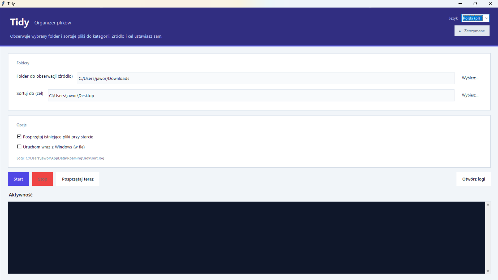
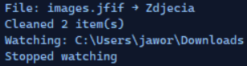

# Tidy

[](LICENSE)
[](https://www.microsoft.com/windows)
[](https://www.python.org/)

**English** · [Polski](#polski)

Tidy is a small Windows program that watches a folder you choose and moves new files into category folders (documents, photos, video, and so on). You set the **source** folder and the **destination** root in the app. Downloads and Desktop are only the default paths on first run.

Run **`Tidy.exe`** or double-click **`launch.vbs`**. No terminal needed for daily use.

To push this project to GitHub, see [docs/GITHUB.md](docs/GITHUB.md).

---

## Screenshots

Main window (English):


Main window (Polish):



Activity log:



---

## Features

- Any source and destination folders (not limited to Downloads or Desktop).
- Sorting by file extension into folders such as `Documents`, `Photos`, `Video`, `Music`, `Archives`, `Installers`, `Disk_images`, `Other`, and `Folders_from_downloads`.
- UI in English or Polish (switch in the header; choice is saved).
- Skips common incomplete download extensions (`.crdownload`, `.part`, `.tmp`, and similar).
- If a file with the same name already exists, the app adds `(1)`, `(2)`, and so on.
- Optional one-time cleanup of the source folder when you press Start.
- Optional start with Windows (minimized).
- On-screen activity feed plus log file at `%APPDATA%\Tidy\sort.log`.

```
[Watch folder]  ->  [Destination folder]
                      ├── Documents
                      ├── Photos
                      ├── Video
                      ├── Music
                      ├── Archives
                      ├── Installers
                      ├── Disk_images
                      ├── Other
                      └── Folders_from_downloads
```

---

## Quick start

### Tidy.exe (recommended)

Build once (Python is only required for this step):

```powershell
cd path\to\porzadek
.\build.bat
```

Copy `Tidy.exe` wherever you like. Settings are stored in `%APPDATA%\Tidy\config.json`, not beside the executable.

### Python

```powershell
python -m pip install -r requirements.txt
pythonw app.py
```

### Without a console window

Double-click `launch.vbs`.

---

## Controls

| Control | What it does |
|---------|----------------|
| Watch folder | Folder monitored for new files |
| Sort into | Root where category subfolders are created |
| Language | English or Polski |
| Start / Stop | Turn watching on or off |
| Clean now | Sort everything currently in the source folder |
| Launch with Windows | Add a Startup shortcut (starts minimized) |
| Open logs | Open `sort.log` in your default editor |

Example custom mapping in `config.json`:

```json
".epub": "Documents"
```

---

## Tech stack

| Layer | Choice |
|-------|--------|
| Language | Python 3.10+ |
| Desktop UI | [Tkinter](https://docs.python.org/3/library/tkinter.html) (standard library on Windows) |
| Folder watching | [watchdog](https://github.com/gorakhargosh/watchdog) (Windows directory change notifications) |
| Standalone app | [PyInstaller](https://pyinstaller.org/) (`build.bat` builds a single windowed `Tidy.exe`) |
| Silent launch | `launch.vbs` (runs `Tidy.exe` or `pythonw app.py` without a console) |
| Settings | JSON file in `%APPDATA%\Tidy\` |
| Logging | Python `logging` module to `sort.log` |
| OS integration | Windows known-folder IDs for default Downloads/Desktop paths; Startup folder shortcut for autostart |

No web server, no database, no extra runtime beyond Python (or the bundled exe).

---

## How the code is organized

| File | Role |
|------|------|
| `app.py` | Window, buttons, language switch, autostart helper |
| `sorter.py` | Watcher, move rules, duplicate names, “file still downloading” checks |
| `config.py` | Default paths, extension map, load/save config |
| `i18n.py` | English and Polish UI strings |
| `automate.py` | Same entry point as `app.py` (`python automate.py`) |

The UI runs on the main thread. File moves and the watchdog callbacks use background threads so the window stays responsive. Log lines from worker threads are passed to the text area through a queue.

---

## Project layout

```
porzadek/
├── app.py
├── sorter.py
├── config.py
├── i18n.py
├── automate.py
├── build.bat
├── launch.vbs
├── requirements.txt
├── docs/
│   ├── GITHUB.md
│   └── screenshots/
└── LICENSE
```

---

## Requirements

- Windows 10 or 11
- Python 3.10+ (for development and building the exe)
- `watchdog` (see `requirements.txt`)

---

## Troubleshooting

| Problem | What to try |
|---------|-------------|
| `launch.vbs` does nothing | Install Python with “Add to PATH”, or build `Tidy.exe` |
| Wrong folders | Use Browse on Watch folder / Sort into |
| Files not moving | Press Start and check the activity panel or log |
| Old config location | Earlier builds used `%APPDATA%\Porzadek\`; the app copies that to `%APPDATA%\Tidy\` when possible |

---

## License

[MIT](LICENSE)

---

# Polski

Tidy to lekka aplikacja na Windows. Obserwuje wybrany folder i przenosi nowe pliki do podfolderów według typu. **Źródło** i **cel** ustawiasz w oknie. Domyślnie program podpowiada Pobrane i Pulpit, ale możesz wskazać np. folder projektu albo dysk sieciowy.

[↑ English](#tidy) · [GitHub: pierwszy push](docs/GITHUB.md)

---

## Zrzuty ekranu

Okno główne (angielski interfejs):


Okno główne (polski interfejs):


Log aktywności:


---

## Funkcje

- Dowolny folder źródłowy i docelowy.
- Sortowanie po rozszerzeniu do folderów m.in. `Documents`, `Photos`, `Video`, `Music`, `Archives`, `Installers`, `Disk_images`, `Other`, `Folders_from_downloads` (nazwy kategorii po angielsku, żeby ścieżki były spójne).
- Interfejs po angielsku lub po polsku.
- Pomija typowe pliki tymczasowe pobierania.
- Duplikaty nazw: dopisek `(1)`, `(2)` itd.
- Opcjonalne sprzątanie źródła przy starcie i autostart z Windows.
- Log: `%APPDATA%\Tidy\sort.log`.

---

## Szybki start

```powershell
.\build.bat
```

Potem uruchamiasz `Tidy.exe`, albo `pythonw app.py`, albo `launch.vbs`.

Ustawienia: `%APPDATA%\Tidy\config.json`.

---

## Sterowanie

| Element | Działanie |
|---------|-----------|
| Folder do obserwacji | Co jest skanowane |
| Sortuj do | Gdzie tworzone są podfoldery |
| Język | English / Polski |
| Start / Stop | Włącza lub wyłącza nasłuchiwanie |
| Posprzątaj teraz | Jednorazowe sortowanie źródła |
| Uruchom wraz z Windows | Skrót w Autostarcie (zminimalizowane okno) |
| Otwórz logi | Plik `sort.log` |

---

## Technologie

| Warstwa | Narzędzie |
|---------|-----------|
| Język | Python 3.10+ |
| Interfejs | Tkinter (biblioteka standardowa) |
| Obserwacja folderu | watchdog |
| Plik .exe | PyInstaller (`build.bat`) |
| Uruchomienie bez konsoli | `launch.vbs` |
| Konfiguracja | JSON w `%APPDATA%\Tidy\` |
| Logi | moduł `logging` |
| Windows | znane foldery (Pobrane/Pulpit), skrót w Autostarcie |

---

## Kod

| Plik | Zadanie |
|------|---------|
| `app.py` | Okno, język, autostart |
| `sorter.py` | Reguły przenoszenia i watcher |
| `config.py` | Domyślne ścieżki i mapowanie rozszerzeń |
| `i18n.py` | Teksty EN / PL |

Interfejs działa w wątku głównym; przenoszenie plików i zdarzenia watchera lecą w tle. Komunikaty do panelu aktywności idą przez kolejkę.

---

## Problemy

| Problem | Co zrobić |
|---------|-----------|
| `launch.vbs` nic nie otwiera | Python w PATH albo zbuduj `Tidy.exe` |
| Zła ścieżka | Wybierz foldery przyciskiem Wybierz |
| Pliki stoją w miejscu | Start + log / panel aktywności |
| Stary config | `%APPDATA%\Porzadek\` może zostać skopiowany do `%APPDATA%\Tidy\` |

---

## Licencja

[MIT](LICENSE)
